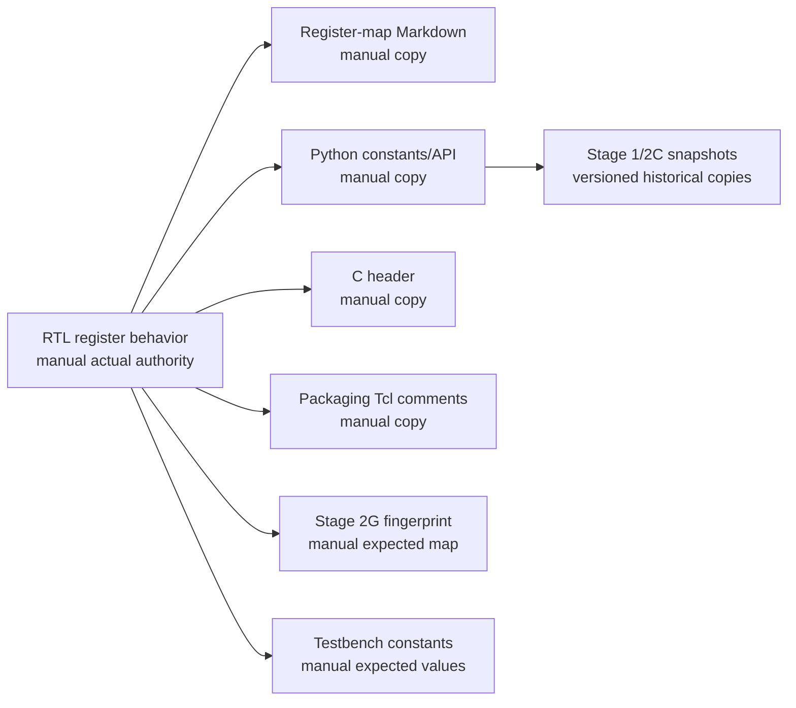

# Stage 2H single-source register-map convergence trade-off

Date: 2026-08-07
Status: A1 final architecture closure audit; implementation not started
Base: `c38df7cfc7a9fae28cb9ddc70fd16994e7e4b794`

## Outcome

Stage 2H selects a strict repository-owned JSON register specification for a
future implementation. The audit contract is
`spec/stage2h_register_map_convergence.json`; it records the decision but is not
the future live register source. The future source path is
`spec/register_map.json`, validated by `spec/register_map.schema.json`.

```text
REGISTER_MAP_SINGLE_SOURCE_AUTHORITY=spec/register_map.json
SPEC_FORMAT=STRICT_JSON
SPEC_SCHEMA_VERSIONED=YES
FULL_RTL_GENERATION_OR_METADATA_GENERATION=GENERATED_PACKAGE_INCLUDE_PLUS_HANDWRITTEN_BEHAVIOR
DETERMINISTIC_GENERATION=REQUIRED
HAND_EDIT_GENERATED_ARTIFACTS=FORBIDDEN
REGISTER_MAP_SOURCE_OWNS_BEHAVIOR_SEMANTICS=YES
HANDWRITTEN_RTL_IS_UNTRACKED_AUTHORITY=NO
GENERATED_CONFORMANCE_ARTIFACT=spec/generated/protection_register_map_conformance.json
GENERATED_ARTIFACT_TOPOLOGY_AUTHORITY=ONE_MASTER_LIST
MASTER_GENERATED_ARTIFACT_TOPOLOGY=PASS_8_OF_8
TAXONOMY_CONSUMERS_MAPPED_TO_MASTER_ARTIFACTS=PASS_7_OF_7
UNOWNED_GENERATED_ARTIFACT_PATHS=0
DUPLICATE_GENERATED_ARTIFACT_PATHS=0
LEGACY_RTL_FAULT_DEFS_PATH_PRESERVED=YES
LEGACY_RTL_FAULT_NAMES_PRESERVED=YES
FAULT_DEFS_CONTAINS_INDEPENDENT_MANUAL_VALUES_AFTER_CONVERGENCE=NO
LEGACY_C_HEADER_PATH_PRESERVED=YES
LEGACY_C_FAULT_NAMES_PRESERVED=YES
CURRENT_SUBSTAGE=STAGE2H_A1_REGISTER_MAP_AND_PUBLIC_ABI_ARCHITECTURE
STAGE2H_A1_IMPLEMENTATION_STARTED=NO
STAGE2H_A_COMPLETE=NO
STAGE2H_COMPLETE=NO
NEXT_AFTER_STAGE2H_A1=STAGE2H_A2_REGISTER_MAP_AND_PUBLIC_ABI_IMPLEMENTATION
STAGE2H_B=RTL_ARCHITECTURE_AND_MODULE_BOUNDARY_CONVERGENCE
STAGE2H_C=BUILD_GENERATION_VERIFICATION_AND_REPOSITORY_CONVERGENCE
STAGE2H_D=INTEGRATED_REGRESSION_COVERAGE_AND_RELEASE_CLOSURE
STAGE2I=SYNTHESIS_IMPLEMENTATION_TIMING_AND_DIGITAL_BOARD_CLOSURE
STAGE2H_B_STATUS=NOT_STARTED
STAGE2H_C_STATUS=NOT_STARTED
STAGE2H_D_STATUS=NOT_STARTED
STAGE2I_STATUS=NOT_STARTED
STAGE2H_A1_AUDIT_CONTRACT=spec/stage2h_register_map_convergence.json
FUTURE_LIVE_REGISTER_MAP_SOURCE=spec/register_map.json
AUDIT_CONTRACT_IS_FUTURE_LIVE_REGISTER_MAP_SOURCE=NO
POLICY_EVALUATION_SEQUENCE_IS_SNAPSHOT_TOKEN=NO
READ_POLICY_SNAPSHOT_API=DEFERRED
SELECTED_ABI_1_1_REGISTER_COUNT=8
SELECTED_ABI_1_1_REGISTER_COVERAGE=DERIVED_PASS_8_OF_8
SELECTED_ABI_1_1_FIELD_COVERAGE=DERIVED_PASS_43_OF_43
SELECTED_ABI_1_1_BIT_COVERAGE=DERIVED_PASS_256_OF_256
CAPABILITY_DEPENDENCY_COVERAGE=DERIVED_PASS_7_OF_7
CAPABILITY_DEPENDENCY_AUTHORITY=capability_dependency_matrix
CAPABILITY_EDGE_COVERAGE=DERIVED_PASS_83_OF_83
FIELD_CAPABILITY_EDGE_MISMATCHES=0
API_CAPABILITY_GATE_MISMATCHES=0
BINDING_CONFORMANCE_EDGE_MISMATCHES=0
CAPABILITY_IMPLICATION_GRAPH=ACYCLIC
CAPABILITY_IMPLICATION_VIOLATIONS=0
FREE_FORM_CAPABILITY_EXPRESSIONS=0
REGISTER_RESET_AUTHORITY=DERIVED_FROM_FIELD_RESETS
REGISTER_STATIC_VALUE_AUTHORITY=DERIVED_FROM_FIELD_STATIC_VALUES
MANUAL_REGISTER_RESET_DUPLICATION=FORBIDDEN
SELECTED_REGISTER_RESET_DERIVATION=PASS_8_OF_8
SELECTED_REGISTER_STATIC_VALUE_DERIVATION=PASS_3_OF_3
REGISTER_FIELD_RESET_MISMATCHES=0
REGISTER_FIELD_STATIC_VALUE_MISMATCHES=0
REGISTER_FIELD_ACCESS_MISMATCHES=0
NON_MACHINE_EVALUABLE_REGISTER_VALUES=0
PARAMETERIZED_REGISTER_EXPRESSIONS=VALIDATED
CAPABILITIES_1_WIDTH16=0x20101006
CAPABILITIES_1_WIDTH24=0x20101806
CAPABILITIES_1_WIDTH32=0x20102006
FAULT_CODE_ENUM_COVERAGE=DERIVED_PASS_7_OF_7
FAULT_CAUSE_ENUM_COVERAGE=DERIVED_PASS_6_OF_6
FAULT_BITMAP_WIDTH=6
FAULT_BITMAP_VALID_MASK=0x0000003F
FAULT_BITMAP_RESERVED_MASK=0xFFFFFFC0
FAULT_TAXONOMY_CONSUMER_PLAN=APPROVED
LEGACY_FAULT_NAME_ALIAS_PLAN=APPROVED
COMPATIBILITY_PROJECTION=APPROVED
DYNAMIC_VALUE_SOURCE_COVERAGE=DERIVED_PASS_24_OF_24
DYNAMIC_FIELDS_WITHOUT_TYPED_SOURCE=0
OPAQUE_DYNAMIC_BINDINGS_WITHOUT_SOURCE_CONTRACT=0
POLICY_STATUS_ONE_HOT_INVARIANT=APPROVED
POLICY_STATUS_RELATIONAL_INVARIANTS=APPROVED
BITMAP_MASK_AND_LIFETIME_INVARIANTS=APPROVED
CONFORMANCE_SCENARIO_DEFINITION_COVERAGE=DERIVED_PASS_17_OF_17
CONFORMANCE_FAMILIES_WITHOUT_MACHINE_SCENARIOS=0
STAGE2H_IMPLEMENTATION_STARTED=NO
REGISTER_MAP_CONVERGENCE_CLOSED=NO
```

JSON is selected because this repository already owns strict JSON contracts,
duplicate-key checks, schemas, mutation fixtures, and Python audit tooling. The
format is reviewable without a specialized compiler and can be canonicalized
without YAML loader ambiguity. SystemRDL remains the strongest standardized
alternative if the map later needs arrays, address-map reuse, or complex
register-file composition that exceeds the selected schema.

## Frozen boundary

The following authorities remain unchanged:

```text
STAGE2G_SAMPLE_EVENT_AUTHORITY=ATOMIC_RAW_CDC_DESTINATION_DELIVERY_EVENT
STAGE2G_FAULT_INPUT_AUTHORITY=RAW_PROTECTION_EVALUATION
NORMALIZED_TELEMETRY_GATES_FAULT_POLICY=NO
FAULT_EVAL_SEQUENCE_WIDTH=OBS_SEQUENCE_WIDTH
SUPPORTED_SEQUENCE_WIDTHS=16_TO_32
FAULT_EVALUATION_LATENCY_ACLK=3
CLEAR_PROTOCOL=REQUEST_EVALUATION_FENCED
PUBLIC_RECOVERY_COMPLETE=LATER_CLEAN_HEALTHY_EVALUATION_ENTERING_ARMED
SOFTWARE_RECOVERY_API_SEMANTICS_PRESERVED=YES
```

This audit changes no RTL, runtime software, C constants, Tcl packaging
behavior, IP-XACT component metadata, packaged port, public address, RTL reset
behavior, or access effect. Physical scale and calibration remain outside the
register-map contract.

## Current authority inventory

The Tcl packaging source explicitly names `RTL_DOC_C_HEADER_PYTHON` as the
external register-map authority. Those four independently maintained surfaces
are the current duplicate authority count:

```text
DUPLICATE_REGISTER_AUTHORITIES=4
ACTUAL_BEHAVIOR_AUTHORITY=rtl/protection_reg_bank.v
```

The current graph has 17 manual or historical definition nodes. Important
nodes are:

| Surface | Present role | Actual role | Coverage | Drift risk |
|---|---|---|---|---|
| `rtl/protection_reg_bank.v` | authoritative | behavioral authority | complete `0x00..0x60` | very high |
| `docs/implementation/register_map.md` | authoritative | validation only | complete map and prose | very high |
| `sw/protection_ip_interface.py` | authoritative consumer | validation only | complete offsets/masks | very high |
| `sw/ps_register_demo/protection_ip_regs.h` | authoritative consumer | validation only | complete offsets/masks | very high |
| `fpga/vivado/package_protection_ip_stage2_axi_lite.tcl` | packaging table | validation only | complete names/access | high |
| `spec/stage2g_implementation_base_fingerprints.json` | frozen expected map | validation only | complete offsets | high |
| `tb/stage2e/tb_stage2e_axi_register_contract.sv` | expected values | validation only | `0x28..0x60` | high |
| coverage/testbench localparams | expected values | validation only | base subsets | high |
| Stage 2C Python probes and notebook | historical | historical | `0x00..0x24` | medium |
| PYNQ-Z2 public snapshot | version-pinned Stage 1 | historical | `0x00..0x24` | low |

The PYNQ-Z2 snapshot HWH contains only the protection IP address block, not
register or field objects. No tracked `component.xml` exists in the development
repository. The packaging root configured by Tcl was absent during this audit.
The current packaging flow creates a `0x1000` address block and explicitly
records `IP_XACT_REGISTER_OBJECTS=NOT_IMPLEMENTED`.



No arrow above is a generator edge. This is validation-only convergence, not a
single source.

## Existing ABI

The complete field table is in
`spec/stage2h_register_map_convergence.json`. The behavioral inventory contains
25 unique, aligned word offsets and no overlapping fields.

| Range | Registers | Access summary | Reset summary |
|---|---|---|---|
| `0x00..0x24` | control, status, fault, raw monitors, thresholds, PWM | RW, W1P, RO, reserved | stored defaults; public monitors reset zero |
| `0x28` | Stage 2E observability capability | RO | `0xE278_2001` for sequence width 32 |
| `0x2C` | sticky observability status | RO/W1C | zero |
| `0x30..0x58` | source/destination/error counters | RO, saturating, reset-only clear | zero |
| `0x5C..0x60` | last source/destination sequence | RO | zero |

Three present documentation statements contradict frozen production behavior:

1. `STATUS.fault_valid` is documented as a raw current-cycle indication. It is
   now the registered evaluation-valid/nonzero-bitmap result three ACLK edges
   after an accepted atomic raw CDC destination delivery.
2. `STATUS.fault_latched` is documented as clearing at valid clear acceptance.
   Stage 2G retains the public latch and first code through post-clear
   `RESET_WAIT` and clears them only on a later clean healthy evaluation that
   enters `ARMED`.
3. `I_CH1` and `I_CH2` are documented as current live inputs. Their production
   semantics are the latest atomic destination-FIFO delivery registered in
   ACLK. The delivered pair is atomic in hardware, but separate software reads
   are not an atomic pair and can straddle deliveries.

Five additional frozen ABI behaviors are not fully documented: accepted
legacy CTRL/threshold/PWM RW and W1P writes ignore `WSTRB`; undefined reads
return zero/OKAY; undefined writes have no effect/OKAY; only the low eight
address bits participate and therefore alias; and separate `I_CH1`/`I_CH2`
software reads are non-atomic. Every non-historical defect is assigned to the
future behavior-complete spec and generated documentation. Counts are derived
from the classified inventory, never asserted as a checker constant.

```text
CURRENT_ABI_OFFSETS_0X00_TO_0X60=PASS
CURRENT_ABI_DEFECT_COUNT=DERIVED
CURRENT_ABI_CONTRADICTION_COUNT=3
CURRENT_ABI_UNDOCUMENTED_BEHAVIOR_COUNT=5
HARDCODED_CONTRADICTION_COUNT=NO
NO_DUPLICATE_OFFSET=PASS
NO_OVERLAPPING_FIELD=PASS
NO_SOFTWARE_RTL_RESET_MISMATCH=PASS
```

The public production contract for `I_CH1` and `I_CH2` is now unambiguous.
Both words reset to zero and subsequently expose the latest atomic
destination-FIFO delivery as registered ACLK-volatile values. The delivered
pair is atomic in hardware, but two software reads are not an atomic pair.
Reusable direct-input wrapper reset semantics remain an internal variant and
cannot override the production ABI or generated IP-XACT reset value.

```text
PUBLIC_I_CH1_RESET=0
PUBLIC_I_CH2_RESET=0
PUBLIC_I_CH1_I_CH2_SOURCE=LATEST_ATOMIC_DESTINATION_FIFO_DELIVERY
PUBLIC_I_CH1_I_CH2_VOLATILITY=REGISTERED_ACLK_VOLATILE
PUBLIC_I_CH1_I_CH2_SOFTWARE_PAIR_ATOMIC=NO
GENERIC_DIRECT_INPUT_WRAPPER_RESET_SEMANTICS=INTERNAL_VARIANT_NOT_PUBLIC_ABI_AUTHORITY
```

The audit also freezes an easily missed behavior. Once an AXI write is
accepted, `CTRL`, `TH_OC1`, `TH_OC2`, `TH_DIFF`, `PWM_PERIOD`, and `PWM_DUTY`
consume their low data bits without consulting `WSTRB`. `OBS_STATUS_W1C` does
consult byte strobes. Changing the legacy writes to normal byte merging would
be an ABI change, even though normal byte merging is the rule for new `RW`
fields.

Undefined low-byte addresses return zero with an OKAY response, and writes have
no effect with an OKAY response. The public address input is eight bits, so an
outer segment larger than `0x100` can alias through the low eight address bits.
That behavior is frozen until an ABI-major and packaging review changes it.

## Source-format comparison

Scores use 1 as weak/high burden and 5 as strong/low burden. Tool availability
means availability in a clean offline repository checkout.

| Criterion | JSON + schema | SystemRDL | Python typed DSL | Existing + validation |
|---|---:|---:|---:|---:|
| Semantic expressiveness | 4 | 5 | 5 | 2 |
| Access/reset support | 4 | 5 | 5 | 2 |
| Array/window support | 3 | 5 | 5 | 1 |
| IP-XACT interoperability | 4 | 5 | 3 | 2 |
| RTL integration burden | 4 | 3 | 4 | 5 |
| Python integration | 5 | 3 | 5 | 3 |
| Deterministic generation | 5 | 4 | 4 | 2 |
| Offline reproducibility | 5 | 2 | 4 | 5 |
| Reviewability | 5 | 4 | 3 | 2 |
| Schema validation | 5 | 5 | 4 | 1 |
| Mutation testing | 5 | 4 | 5 | 2 |
| Long-term maintenance | 5 | 4 | 3 | 1 |
| Vendor lock-in avoidance | 5 | 4 | 5 | 5 |
| Total | **59** | 53 | 55 | 33 |

### Option A: JSON/YAML

Strict JSON is selected over YAML. JSON has no implicit scalar typing, anchor,
merge-key, or loader-version ambiguity. A closed Draft 2020-12 schema owns the
shape; repository semantic checks own rules JSON Schema cannot express clearly,
including overlap, access interactions, ABI deltas, and capability wiring.

### Option B: SystemRDL

SystemRDL has the best standardized register semantics and natural downstream
ecosystem. Its immediate cost is a new compiler/plugin dependency plus project
extensions for W1P, legacy unstrobed writes, generated Tcl integration, and the
repository's compatibility manifest. It becomes preferred if arrays, windows,
hierarchical register files, or exchange with multiple external EDA tools
become a real requirement.

### Option C: Python typed DSL

A typed DSL offers excellent checks and direct generation, but executable
source is harder to review as pure data, can make import-time behavior part of
the authority, and creates Python API/version coupling. The repository already
has an interpreter-portability fingerprint issue; making Python execution the
register authority would enlarge that problem.

### Option D: existing sources plus validation

This can detect selected disagreement but does not answer which source wins,
cannot prevent simultaneous matching edits to multiple copies, and retains the
manual update graph. It is the current baseline and is rejected as the final
architecture.

## RTL-generation comparison

| Architecture | Correctness | Auditability | Integration burden | Verification burden | Disposition |
|---|---:|---:|---:|---:|---|
| Generate complete register bank | 5 | 2 | 2 | 4 | not selected |
| Generate package/includes, keep behavior handwritten | 5 | 5 | 4 | 4 | selected |
| Generate IP-XACT first, derive other outputs | 3 | 3 | 2 | 3 | rejected |

The selected design generates offsets, masks, reset constants, enums, decode
metadata, software constants, IP-XACT construction Tcl, documentation,
verification values, and a behavioral conformance oracle. Handwritten RTL may
continue to implement policy transitions, clear fencing, and CDC wiring, but it
does not independently own their register-facing semantics. The source owns
behavior IDs, side-effect IDs, event priority, pulse width, domains, and
bindings. Static checks must prove every handwritten case consumes a generated
binding and implements the exact behavior recorded by the spec.

IP-XACT is a derivative because it does not naturally express every local
semantic, especially W1P and the frozen legacy `WSTRB` extension, without
vendor extensions. Generated Tcl must create register and field objects and
must emit mandatory vendor extensions rather than silently lowering W1P to
W1S.

## Selected authority contract

The future source owns, for each register or field as applicable: offset and
field range; access and reset; read and write semantics; `WSTRB` policy and any
legacy extension; side-effect ID, event priority, and pulse width; volatility,
clock domain, reset domain, and snapshot group; capability dependency;
software, RTL, and IP-XACT names; description; and deprecation/compatibility
state. Any new behavior requires a register-map schema-major migration.

Generated outputs are:

1. `rtl/generated/protection_register_map.vh`;
2. `sw/generated/protection_register_map.py`;
3. `sw/ps_register_demo/protection_ip_regs.h`;
4. `fpga/vivado/generated/protection_register_map_ipxact.tcl`;
5. `docs/implementation/register_map.md`;
6. `tb/generated/protection_register_map.svh`; and
7. `spec/generated/protection_register_map_compatibility.json`; and
8. `spec/generated/protection_register_map_conformance.json`.

Each output header records the generator semantic version, register-spec schema
version, and full canonical spec SHA-256. Per-output hashes live in the
compatibility manifest to avoid self-referential output hashes. Output bytes
are UTF-8, LF, final-newline, canonically ordered, and contain no timestamp,
host name, absolute path, or Git worktree identity.

Generation stages files in a temporary directory, validates all outputs, then
replaces changed outputs atomically. Identical bytes cause no rewrite. Any
schema, semantic, rendering, or write failure publishes no partial set.

CI regenerates into a fresh temporary directory and compares every byte with
the committed outputs. The build fails for stale artifacts, a hand edit,
missing output, extra output, nondeterminism, manifest mismatch, an unconsumed
behavior ID, an RTL binding without a spec entry, a field without a generated
conformance vector, or a manually authored expected value.

## Access taxonomy

| Type | Write | Read | Strobe and side-effect rule | IP-XACT |
|---|---|---|---|---|
| RO | no effect | current value | every write lane has no effect | `read-only` |
| RW | byte merge | stored value | owning `WSTRB` required; explicit legacy exception | `read-write` |
| WO | command/data effect | zero | owning `WSTRB` required | `write-only` + extension |
| W1C | strobed one clears | stored cause | new event wins; zero preserves | `oneToClear` |
| W1S | strobed one sets | stored bit | declared clear precedence required | `oneToSet` |
| W1P | strobed one pulses | zero | pulse is request, not completion | mandatory W1P extension |
| RC | writes ignored | value before clear | clear once at read-response commit | `readAction=clear` |
| RSVD | ignored | zero | software writes zero | reserved/omitted + mask |

No free-form access behavior is permitted. A behavior not represented above
requires a named, schema-versioned extension with RTL, software, IP-XACT, and
verification rules. Existing unstrobed writes use
`LEGACY_IGNORE_WSTRB`; no new field may use that extension.

The finite behavior vocabulary initially contains:

| Behavior ID | Frozen contract |
|---|---|
| `RO_STATIC` | immutable read value; writes ignored |
| `RO_REGISTERED_VOLATILE` | registered/synchronized producer read; writes ignored |
| `RW_STROBED` | owning byte lanes merge into stored state |
| `RW_LEGACY_IGNORE_WSTRB` | accepted legacy write consumes declared data bits without strobes |
| `W1C_EVENT_WINS` | strobed one clears, but a same-cycle event wins |
| `W1P_ONE_ACLK` | qualified one produces exactly one ACLK pulse and reads zero |
| `RSVD_ZERO_IGNORE` | reads zero and writes have no effect |
| `UNKNOWN_ZERO_OKAY` | undefined reads are zero/OKAY and writes no-effect/OKAY |
| `ADDRESS_LOW8_ALIAS` | only address bits 7:0 select a word; wider addresses alias |

For ABI 1.1, RO, RW, W1C, W1P, and RSVD are enabled. WO, W1S, and RC remain
defined taxonomy but are `DEFINED_TAXONOMY_NOT_ENABLED_FOR_ABI_1_1`; schema and
semantic checks reject their use until complete versioned behavior and
conformance rules are approved. `RW_STROBED` is likewise defined for a future
new RW field but is not an enabled, unconsumed ABI 1.1 behavior.

The selected binding matrix contains 99 concrete targets: all 54 current
fields, all 43 fields in the eight selected ABI 1.1 registers, unknown-address
behavior, and the low-eight-bit address aperture. The deferred
`CLEAR_EVENT_STATUS` candidate is not a selected field, binding, or conformance
target. Each selected record owns its behavior ID, unique RTL binding ID,
side-effect ID, generated conformance family, and implementation status.
Coverage is computed from the selected allocation, register definitions, and
binding keys; Boolean declarations are not accepted as proof.

The generated conformance JSON derives reset expectations, read values and
masks, write effects, every `WSTRB` combination, legacy exceptions, W1C
priority, W1P pulse/read-zero behavior, reserved and unknown-address behavior,
side-effect IDs, and capability dependencies. The future generic consumer is
`tools/run_register_map_conformance.py`; both it and the conformance artifact
remain proposed, not implemented by this audit.

```text
EVERY_PUBLIC_FIELD_HAS_ONE_BEHAVIOR_ID=YES
EVERY_BEHAVIOR_ID_HAS_RTL_BINDING=YES
EVERY_BINDING_HAS_SPEC_GENERATED_TESTS=YES
BEHAVIOR_BINDING_COVERAGE=DERIVED_PASS_99_OF_99
UNBOUND_PUBLIC_FIELDS=0
DUPLICATE_BEHAVIOR_BINDINGS=0
UNCONSUMED_ENABLED_BEHAVIOR_IDS=0
APPROVED_ENABLED_ACCESS_TYPES_WITHOUT_BEHAVIOR_ID=0
WO_W1S_RC_ABI_1_1_ENABLEMENT=DEFINED_TAXONOMY_NOT_ENABLED
```

## Snapshot and clock-domain contract

`OBS_CAPABILITY[23]=0` remains authoritative: there is no current atomic
multi-register snapshot.

| Group | Source class | Software coherence |
|---|---|---|
| `STATUS` bits | registered ACLK status | same-cycle within one word |
| `STATUS` + `FAULT_CODE` | separate ACLK words | independently coherent |
| `I_CH1` + `I_CH2` | atomic FIFO-derived pair | not atomic across two reads |
| source counters/last source sequence | independent Gray synchronizers | eventually consistent |
| destination counters/last destination sequence | ACLK registers | independently coherent |
| `OBS_STATUS_W1C` | sticky ACLK history | same-cycle within one word |
| first/live/seen bitmaps | registered ACLK episode state | independently coherent |
| state/readiness/clear levels | registered ACLK status | same-cycle in future `POLICY_STATUS` |
| normalized telemetry | sequence-associated internal telemetry | no current public snapshot |

The proposed `POLICY_EVALUATION_SEQUENCE` is only the diagnostic delivered
sample identity of the most recent policy retirement. The diagnostic last-retirement identity is not a snapshot token: it may duplicate, become
stale, restart at the source, reset to zero, or remain unchanged while
`CLEAR_PENDING` and other public policy state changes. Software must not bracket
cross-word reads with it.

Three coherence designs were compared. Option A adds a dedicated public-state
update epoch that must change on clear request capture, clear resolution,
fault/healthy state transitions, bitmap updates, compatibility-status updates,
and reset; it must never reuse the delivered sample sequence. Option B adds a
command handshake and shadow snapshot bank. Option C exposes independently
coherent words and defers a cross-word snapshot API. ABI 1.1 selects Option C
because no concrete software requirement justifies the additional hardware.

```text
POLICY_EVALUATION_SEQUENCE_ROLE=DIAGNOSTIC_LAST_RETIREMENT_IDENTITY
POLICY_EVALUATION_SEQUENCE_IS_SNAPSHOT_TOKEN=NO
READ_POLICY_SNAPSHOT_API=DEFERRED
POLICY_MULTI_REGISTER_COHERENCE=INDEPENDENTLY_COHERENT_NO_ATOMIC_OR_SEQUENCE_BRACKETED_CLAIM
POLICY_SNAPSHOT_OVERCLAIM=NO
POLICY_SNAPSHOT_OPTION=OPTION_C_DEFER_CROSS_WORD_SNAPSHOT
```

## ARMED and recovery policy

The future read-only field is `POLICY_STATUS.ARMED_READY`, active high, reset
zero. Its only authority is the Stage 2G registered policy state.

| Policy state | `ARMED_READY` |
|---|---:|
| initial `RESET_WAIT` | 0 |
| `ARMED` | 1 |
| `FAULT_LATCHED` | 0 |
| post-clear `RESET_WAIT` | 0 |

```text
ARMED_READY_EXPOSURE=APPROVED
ARMED_READY_INITIAL_RESET_WAIT=0
ARMED_READY_ARMED=1
ARMED_READY_FAULT_LATCHED=0
ARMED_READY_POST_CLEAR_RESET_WAIT=0
RECOVERY_IS_VERIFIED_SCOPE=POST_FAULT_RECOVERY_ONLY
RECOVERY_IS_VERIFIED_IS_STARTUP_READY=NO
```

`recovery_is_verified()` is preserved exactly. It can return true during
initial `RESET_WAIT` because the compatibility status and code are reset-clear.
That is acceptable only under its post-fault workflow precondition. It is not
renamed, broadened, or used by `startup_ready()`.

## Fault bitmap and clear visibility

`first_fault_bitmap`, `live_fault_bitmap`, and `fault_seen_bitmap` are all
approved for future additive exposure. They are zero-extended to 32-bit words;
`CAPABILITIES_1` publishes the implemented bitmap width, initially six. First
is immutable within an episode, live follows clean eligible evaluations while
latched, and seen is an episode-local OR history. All clear at internal episode
end/reset even while the public compatibility latch can remain set during
post-clear wait. Software must not assume bitmap lifetime equals compatibility
status lifetime.

The bitmap lifetime is distinct from the public compatibility-latch lifetime.
After a legal clear enters post-clear `RESET_WAIT`, the approved mixed state is:

```text
legacy FAULT_CODE = prior first cause (may remain nonzero)
new FIRST_FAULT_BITMAP = 0
new LIVE_FAULT_BITMAP = 0
new FAULT_SEEN_BITMAP = 0
POST_CLEAR_RECOVERY_PENDING = 1
```

Stable `clear_pending` and `post_clear_recovery_pending` levels are approved in
`POLICY_STATUS`. Pulse-only clear-accepted, clear-rejected, and reason outputs
are represented only by the unallocated deferred `CLEAR_EVENT_STATUS`
candidate. That candidate is outside the selected ABI 1.1 register, field,
binding, and conformance universes. A later proposal must retain events as W1C status or monotonic
counters, define multiple-request behavior and reasons, and connect mutations
through the production path.

```text
FAULT_BITMAP_EXPOSURE=EXPOSE_FIRST_LIVE_SEEN
CLEAR_RECOVERY_STATUS_EXPOSURE=EXPOSE_LEVELS_EVENTS_DEFERRED
FIRST_LIVE_SEEN_BITMAP_LIFETIME=ACTIVE_INTERNAL_EPISODE
POST_CLEAR_RESET_WAIT_BITMAPS=ZERO
PUBLIC_COMPATIBILITY_FAULT_CODE_MAY_REMAIN_NONZERO=YES
BITMAP_COMPATIBILITY_LIFETIME_DOCUMENTED=PASS
DEFERRED_REGISTER_CANDIDATES=1
CLEAR_EVENT_STATUS_ABI_1_1_STATUS=DEFERRED_NOT_SELECTED
DEFERRED_CANDIDATES_COUNTED_AS_SELECTED_ABI=0
```

## Fault taxonomy and semantic authorities

`fault_taxonomy` is the sole future authority for the compatibility code and
the three cause bitmaps. It freezes seven values: `NONE=0x00`,
`OVERCURRENT=0x01`, `SENSOR_MISMATCH=0x02`, `SENSOR_OPEN=0x03`,
`SENSOR_SATURATION=0x04`, `SENSOR_STUCK=0x05`, and
`OC_WITH_ANY_SENSOR=0x06`. Generated aliases preserve current Verilog and C
names, including `FAULT_OC_WITH_SENSOR` and
`PROTECTION_FAULT_OC_WITH_SENSOR`. Current
`FAULT_CODE.fault_code_latched` explicitly references this enumeration.

The cause authority assigns bits 0 through 5 to channel-1 overcurrent,
channel-2 overcurrent, mismatch/differential, open, saturation, and stuck.
Each bitmap register represents these as six named one-bit fields plus
`RESERVED[31:6]`; the valid and reserved masks are exact complements. The
compatibility projection evaluates the complete bitmap in this priority:
combined overcurrent and any sensor cause, overcurrent, saturation, open,
stuck, mismatch, then none. This projection intentionally collapses causes;
the bitmap retains simultaneous information.

A new cause inside the reserved range is an additive ABI-minor change with a
capability and width update. Renumbering a cause is an ABI-major change.
Changing a compatibility-code value or projection is also ABI-major unless a
separately versioned compatibility code is introduced. The future generator
derives the Verilog include, Python `IntEnum`/`IntFlag`, C and SystemVerilog
constants, IP-XACT enumeration metadata, register documentation, and
conformance vectors from this one authority. Manual taxonomy copies are
forbidden after convergence.

`dynamic_value_source_contract` is a closed, project-specific grammar with four
kinds: `SIGNAL`, `STATE_EQUALS`, `MASK_SIGNAL_BY_WIDTH`, and
`REGISTERED_EVENT_CAPTURE`. It binds all 24 dynamic selected fields through the
ten-entry `stage2h_rtl_source_bindings` table. The five policy levels bind to
the Stage 2G state and clear-level signals; the 18 cause fields select
valid-mask-enforced bits from their episode bitmap; and the diagnostic sequence
captures `fault_eval_sequence` whenever `fault_eval_valid` is one, holds while
invalid, resets to zero, and zero-extends from `OBS_SEQUENCE_WIDTH` to 32. Clean
and non-clean valid retirements both capture. Unknown kinds, binding IDs,
states, transforms, and widths fail closed. Current-ABI dynamic fields must gain
the same explicit treatment before generator convergence; the compatibility
fault field already binds through `fault_taxonomy`.

`cross_field_invariants` evaluates at one common Stage 2G policy ACLK edge and
does not claim software-atomic cross-register reads. Exactly one of armed,
fault-latched, and reset-wait is true. Clear pending implies fault-latched;
post-clear pending implies reset-wait and excludes clear pending; armed excludes
both pending levels. Bitmap upper bits are zero, all episode bitmaps are zero
outside an active fault episode, first-fault is immutable within an episode,
and seen-fault is a monotonic OR history.

Conformance uses seven finite templates under
`conformance_scenario_definitions`: five selected-field templates and two
project-contract templates. The 43 selected fields are assigned exactly once;
the templates derive reset, source relationship, mask/extension and transition
expectations from register-map authority. Ten existing behavior families remain
explicit directed tests, while all 17 enabled families have a deterministic
template route or directed-test route. There is no programmable clause DSL or
generic interpreter.

```text
FAULT_CODE_ENUM_COVERAGE=DERIVED_PASS_7_OF_7
FAULT_CAUSE_ENUM_COVERAGE=DERIVED_PASS_6_OF_6
FAULT_BITMAP_WIDTH=6
FAULT_BITMAP_VALID_MASK=0x0000003F
FAULT_BITMAP_RESERVED_MASK=0xFFFFFFC0
FAULT_TAXONOMY_CONSUMER_PLAN=APPROVED
LEGACY_FAULT_NAME_ALIAS_PLAN=APPROVED
COMPATIBILITY_PROJECTION=APPROVED
DYNAMIC_VALUE_SOURCE_COVERAGE=DERIVED_PASS_24_OF_24
DYNAMIC_FIELDS_WITHOUT_TYPED_SOURCE=0
OPAQUE_DYNAMIC_BINDINGS_WITHOUT_SOURCE_CONTRACT=0
POLICY_STATUS_ONE_HOT_INVARIANT=APPROVED
POLICY_STATUS_RELATIONAL_INVARIANTS=APPROVED
BITMAP_MASK_AND_LIFETIME_INVARIANTS=APPROVED
CONFORMANCE_SCENARIO_DEFINITION_COVERAGE=DERIVED_PASS_17_OF_17
CONFORMANCE_FAMILIES_WITHOUT_MACHINE_SCENARIOS=0
```

## Capability and ABI discovery

A zero version word proves only that explicit register-map discovery is absent;
it does not prove ABI `1.0` or one uniform historical implementation. The first
explicit additive implementation is ABI `1.1`:

| Offset | Register | Layout |
|---:|---|---|
| `0x80` | `REGISTER_MAP_VERSION` | `[31:16]=0x524D`, `[15:8]=major`, `[7:0]=minor` |
| `0x84` | `CAPABILITIES_0` | readiness, bitmap, clear, Stage 2G, normalization, Stage 2E, sequence features |
| `0x88` | `CAPABILITIES_1` | bitmap width, implemented/min/max sequence widths |

The selected ABI 1.1 model is exactly the selected allocation and covers every
bit in eight 32-bit registers:

| Offset | Register | Complete field layout | Reset |
|---:|---|---|---:|
| `0x80` | `REGISTER_MAP_VERSION` | `MAGIC[31:16]`, `ABI_MAJOR[15:8]`, `ABI_MINOR[7:0]` | `0x524D0101` |
| `0x84` | `CAPABILITIES_0` | bits 0 ARMED_READY, 1 FAULT_BITMAPS, 2 CLEAR_LEVEL_STATUS, 3 STAGE2G_POLICY, 4 NORMALIZED_TELEMETRY_RESERVED_ZERO, 5 STAGE2E_TRANSACTION_OBSERVABILITY, 6 POLICY_EVALUATION_IDENTITY, `[31:7]` RESERVED_ZERO | `0x0000006F` |
| `0x88` | `CAPABILITIES_1` | `FAULT_BITMAP_WIDTH[7:0]=6`, `IMPLEMENTED_SEQUENCE_WIDTH[15:8]=OBS_SEQUENCE_WIDTH`, `MIN_SEQUENCE_WIDTH[23:16]=16`, `MAX_SEQUENCE_WIDTH[31:24]=32` | parameterized; production default `0x20102006` |
| `0xA0` | `POLICY_STATUS` | bits 0 ARMED_READY, 1 FAULT_LATCHED_STATE, 2 RESET_WAIT_STATE, 3 CLEAR_PENDING, 4 POST_CLEAR_RECOVERY_PENDING, `[31:5]` RESERVED | `0x00000004` |
| `0xA4` | `FIRST_FAULT_BITMAP` | six named causes `[5:0]`, `RESERVED[31:6]` | `0` |
| `0xA8` | `LIVE_FAULT_BITMAP` | six named causes `[5:0]`, `RESERVED[31:6]` | `0` |
| `0xAC` | `FAULT_SEEN_BITMAP` | six named causes `[5:0]`, `RESERVED[31:6]` | `0` |
| `0xB0` | `POLICY_EVALUATION_SEQUENCE` | `SEQUENCE[31:0]` | `0` |

Register-level reset and static values in this table are derived reports, not
editable register properties. The only authorities are field `reset` and
`static_value`. Every selected register carries `derived_reset=true` and
`derived_static_value=true`; manually repeating a register reset is forbidden.
The audit composes unsigned 32-bit words, rejects field and aggregate overflow,
and reuses the derived result for the planned IP-XACT reset, generated
documentation word, and conformance default.

`CAPABILITIES_1.IMPLEMENTED_SEQUENCE_WIDTH` uses the closed expression
`{"kind":"parameter","name":"OBS_SEQUENCE_WIDTH"}`. The sole parameter is an
unsigned 8-bit value in 16..32 with configured default 32. Integer literals,
that parameter reference, and a closed dynamic-static marker are the only
expression nodes. Unknown kinds, unknown symbols, prose expressions, and
overflow fail closed. Canonical JSON plus explicit Verilog, Python,
Tcl/IP-XACT, documentation, and testbench render contracts preserve the same
meaning for every planned generator consumer. Dynamic selected fields are
separately bound through the closed `dynamic_value_source_contract`; a prose
`dynamic` marker alone cannot establish a source.

All discovery fields are `RO_STATIC`; reserved discovery fields are
`RSVD_ZERO_IGNORE`. Writes have no effect and complete with OKAY. Every field
also has frozen software, RTL, and IP-XACT names, a binding ID, a side-effect
ID, a conformance family, a matrix-owned capability-gate reference, and
`PROPOSED_NOT_IMPLEMENTED` status. The checker derives 8/8 registers, 43/43
fields, and 256/256 bits from allocation and definitions.

The version decision tree is fail closed:

1. zero means `NO_EXPLICIT_DISCOVERY` and initiates the legacy probe below;
2. a nonzero word whose magic is not `0x524D` is an incompatible or wrong
   device, never legacy;
3. recognized magic with an unsupported ABI major is incompatible; and
4. recognized magic with a supported major applies minor and capability rules.

For zero version, new software reads `OBS_CAPABILITY` at `0x28`. Exact Stage 2E
evidence requires magic `0xE2`, observability version 1, frozen bits 23:20,
counter width 32, and a sequence width in 16..32. It yields Stage 2E
`PRESENT` and preserves the discovered width. Stage 2G and every unrelated
additive feature remain `UNKNOWN`; normalized telemetry is not publicly
exposed. Zero `OBS_CAPABILITY` is rejected because new software does not support
unidentified pre-Stage-2E hardware. Bad nonzero evidence is incompatible.

Capability state is `PRESENT`, `ABSENT`, or `UNKNOWN`, and the typed software
object separately preserves `explicit_discovery`, whether ABI major/minor are
known, raw legacy evidence, and the discovered sequence width. It never returns
one fabricated all-false legacy object.

Each capability bit means a connected, usable public register/API feature. Bit
4 normalized telemetry remains reserved zero because ABI 1.1 approves no public
normalized telemetry register or API. Internal normalized datapaths are not
software capability evidence.

`capability_dependency_matrix` is the sole editable capability-dependency
authority. Selected fields, feature-bit records, and software API plans contain
only validated references into it. Gates use the closed `kind`, `all_of`,
`any_of`, and `none_of` grammar with known, unique, lexicographically ordered
capability IDs. Free-form `|` and `&`, empty mandatory feature gates, unknown
IDs, and positive/negative contradictions are invalid.

The authority freezes 43 field gates and 14 API gates. In particular,
`POLICY_STATUS.ARMED_READY`, `is_armed()`, and `startup_ready()` require both
ARMED_READY and STAGE2G_POLICY; both clear-level fields require
CLEAR_LEVEL_STATUS and STAGE2G_POLICY; bitmap fields and APIs require
FAULT_BITMAPS and STAGE2G_POLICY; and the diagnostic sequence field/API require
POLICY_EVALUATION_IDENTITY and STAGE2G_POLICY. Base discovery, preserved legacy,
and deferred APIs use named non-feature gate kinds rather than invented feature
bits.

The seven capability entries contain 73 exact field-to-RTL-binding-to-
conformance edges and 10 capability-to-API-gate edges. A conformance-family
name found on an unrelated field cannot satisfy an edge. ARMED_READY requires
the status bit and both readiness APIs. FAULT_BITMAPS requires all 21 bitmap
cause/reserved fields and a width in 1..32. CLEAR_LEVEL_STATUS requires both stable clear
levels. STAGE2G_POLICY requires the connected state fields and frozen Stage 2G
public contract metadata. Stage 2E observability requires every exact frozen
`0x28..0x60` binding plus its read and clear APIs. POLICY_EVALUATION_IDENTITY
requires complete width metadata, the diagnostic register, and diagnostic-only
API semantics.

The implication model collapses ARMED_READY, CLEAR_LEVEL_STATUS, and
STAGE2G_POLICY into the `STAGE2G_PUBLIC_STATUS_BUNDLE` equivalence node. The
collapsed graph is a DAG: FAULT_BITMAPS and POLICY_EVALUATION_IDENTITY each
require that bundle, Stage 2E observability is independent, and
NORMALIZED_TELEMETRY is forbidden. Validation vectors prove the default,
minimal bitmap, minimal policy-identity, and no-additive-feature combinations.

For a supported major with a higher minor, software accepts the known prefix,
ignores unknown capability bits, and uses only known features whose complete
dependency and metadata contracts validate. `FAULT_BITMAP_WIDTH` must be
1..32; implemented sequence width must be 16..32; minimum and maximum are 16
and 32 with minimum <= implemented <= maximum. The normalized-telemetry bit is
zero. `CAPABILITIES_0[31:7]` is required zero for minor 1; in a higher minor,
newly defined bits outside the known prefix are unknown and ignored. A bit that
the advertised ABI minor still defines as required-zero is malformed explicit
metadata and is rejected as incompatible, never reclassified as legacy.

```text
ZERO_VERSION_WORD=NO_EXPLICIT_DISCOVERY
NONZERO_BAD_MAGIC=REJECT_INCOMPATIBLE
UNSUPPORTED_MAJOR=REJECT_INCOMPATIBLE
BAD_MAGIC_IS_LEGACY=NO
LEGACY_CAPABILITY_MODEL=PRESENT_ABSENT_UNKNOWN
HISTORICAL_PRE_STAGE2E_HARDWARE_SUPPORTED_BY_NEW_SOFTWARE=NO
STAGE2E_LEGACY_DISCOVERY=OBS_CAPABILITY_PROBE
STAGE2G_LEGACY_CAPABILITY=UNKNOWN
NORMALIZED_TELEMETRY_CAPABILITY_BIT=RESERVED_ZERO
CAPABILITY_BIT_MEANS_PUBLIC_SOFTWARE_USABLE_FEATURE=YES
CAPABILITY_DEPENDENCY_COVERAGE=DERIVED_PASS_7_OF_7
CAPABILITY_DEPENDENCY_AUTHORITY=capability_dependency_matrix
FIELD_CAPABILITY_ANNOTATIONS=VALIDATED_REFERENCES_TO_AUTHORITY
SOFTWARE_API_CAPABILITY_GATES=VALIDATED_REFERENCES_TO_AUTHORITY
CONFORMANCE_DEPENDENCIES=EXACT_BINDING_EDGES_NOT_GLOBAL_NAME_PRESENCE
CAPABILITY_EDGE_COVERAGE=DERIVED_PASS_83_OF_83
FIELD_CAPABILITY_EDGE_MISMATCHES=0
API_CAPABILITY_GATE_MISMATCHES=0
BINDING_CONFORMANCE_EDGE_MISMATCHES=0
CAPABILITY_IMPLICATION_GRAPH=ACYCLIC
CAPABILITY_IMPLICATION_VIOLATIONS=0
FREE_FORM_CAPABILITY_EXPRESSIONS=0
CAPABILITIES_WITH_MISSING_REGISTER_DEPENDENCIES=0
CAPABILITIES_WITH_MISSING_FIELD_DEPENDENCIES=0
CAPABILITIES_WITH_MISSING_BINDING_DEPENDENCIES=0
CAPABILITIES_WITH_MISSING_API_DEPENDENCIES=0
CAPABILITY_WIDTH_CONSTRAINTS=PASS
RESERVED_CAPABILITY_BITS_ZERO=PASS
HIGHER_COMPATIBLE_MINOR_POLICY=APPROVED
MALFORMED_EXPLICIT_CAPABILITY_METADATA=REJECT_INCOMPATIBLE
REGISTER_RESET_AUTHORITY=DERIVED_FROM_FIELD_RESETS
REGISTER_STATIC_VALUE_AUTHORITY=DERIVED_FROM_FIELD_STATIC_VALUES
MANUAL_REGISTER_RESET_DUPLICATION=FORBIDDEN
SELECTED_REGISTER_RESET_DERIVATION=PASS_8_OF_8
SELECTED_REGISTER_STATIC_VALUE_DERIVATION=PASS_3_OF_3
REGISTER_FIELD_RESET_MISMATCHES=0
REGISTER_FIELD_STATIC_VALUE_MISMATCHES=0
REGISTER_FIELD_ACCESS_MISMATCHES=0
NON_MACHINE_EVALUABLE_REGISTER_VALUES=0
PARAMETERIZED_REGISTER_EXPRESSIONS=VALIDATED
CAPABILITIES_1_WIDTH16=0x20101006
CAPABILITIES_1_WIDTH24=0x20101806
CAPABILITIES_1_WIDTH32=0x20102006
```

The existing Stage 2E `OBS_CAPABILITY` is preserved and is not repurposed as
the register-map ABI version.

Git commit identities are not a mandatory runtime ABI. `0x8C..0x9C` is reserved;
a canonical spec-hash fragment can be proposed later only with a collision,
stability, and software-use contract.

## Address allocation

Every address below is proposed and not implemented.

### Alternative A: compact additive block

`0x64..0x7C` packs version/capability, policy status, three bitmaps, policy
sequence, and widths. It minimizes address use but combines unrelated discovery
semantics and leaves no deliberate gap after the frozen block.

### Alternative B: capability plus observability

The selected alternative uses:

| Range | Purpose | Status |
|---|---|---|
| `0x64..0x7C` | reserved legacy-to-v1 gap | `PROPOSED_NOT_IMPLEMENTED` |
| `0x80..0x88` | version and capabilities | `PROPOSED_NOT_IMPLEMENTED` |
| `0x8C..0x9C` | reserved discovery growth | `PROPOSED_NOT_IMPLEMENTED` |
| `0xA0..0xB0` | policy status, bitmaps, evaluation sequence | `PROPOSED_NOT_IMPLEMENTED` |
| `0xB4..0xFC` | reserved future growth | `PROPOSED_NOT_IMPLEMENTED` |

```text
PROPOSED_ADDRESS_BLOCK=0x80..0xB0
NEW_AXI_OFFSETS_IMPLEMENTED=NO
SELECTED_ALLOCATION_EQUALS_SELECTED_REGISTER_MODEL=PASS
SELECTED_ABI_1_1_REGISTER_COUNT=8
SELECTED_ABI_1_1_REGISTER_COVERAGE=DERIVED_PASS_8_OF_8
SELECTED_ABI_1_1_FIELD_COVERAGE=DERIVED_PASS_43_OF_43
SELECTED_ABI_1_1_BIT_COVERAGE=DERIVED_PASS_256_OF_256
ALLOCATED_REGISTERS_WITHOUT_FIELD_CONTRACT=0
FIELD_CONTRACTS_WITHOUT_ALLOCATION=0
UNALLOCATED_FIELDS_COUNTED_AS_ABI_1_1=0
UNCOVERED_SELECTED_REGISTER_BITS=0
OVERLAPPING_SELECTED_REGISTER_BITS=0
DISCOVERY_REGISTER_BEHAVIOR_BINDINGS=DERIVED_PASS_16_OF_16
DISCOVERY_REGISTER_CONFORMANCE_FAMILIES=PASS
RESERVED_DISCOVERY_BITS_ZERO=PASS
```

No existing or reserved word can be reused. All words are four-byte aligned.
The eight-bit RTL aperture limits the current plan to `0xFC`; extending the
aperture or changing alias behavior requires an ABI-major and packaging review.

## Backward compatibility

Old software continues to use `0x00..0x60` unchanged and safely ignores new
words. Generated Python and C names remain stable; reorganized modules must
re-export all current names. Deprecation requires one minor-release warning and
retention for the rest of the major. Removal or semantic change requires an ABI
major.

An ABI-major increment is mandatory for an offset move/removal/alias, field
range or polarity change, access/reset/WSTRB/side-effect change, undefined
address change, incompatible reserved-field use, or low-eight-bit alias change.
An ABI-minor increment may add registers in allocated space, define compatible
reserved fields that old software writes zero, or add a capability with its
implementation.

Reserved bits read zero; generated software writes them zero; hardware ignores
them. This permits future compatible definition only when the ABI review proves
old writers cannot set them.

## Python AST fingerprint convergence

The Stage 2G fingerprint hashes interpreter-default
`ast.dump(node, include_attributes=False)`. Unchanged source hashes to
`9758193b...a9dc` on CPython 3.12.10 and `f13f939f...304` on CPython 3.14.2
because empty-field display changed. That is a false semantic mismatch.

The selected serializer schema is `stage2h-python-semantic-ast-v1`:

1. parse the unique top-level target function;
2. project each supported AST node through a repository-owned semantic-field
   table;
3. omit source locations and interpreter-added fields not present in that
   schema;
4. retain identifier names, constants, operator node types, call structure,
   statement/list order, annotations, defaults, and type comments;
5. wrap the tree with the serializer schema identifier;
6. encode sorted compact UTF-8 JSON; and
7. SHA-256 the exact bytes.

Unknown nodes fail closed and require a serializer-schema migration. The
authoritative AST hash ignores whitespace and comments. A separate full-source
hash is diagnostic, so whitespace/comment edits are classified as
`NON_SEMANTIC_SOURCE_DRIFT`. Local-variable renaming is deliberately
significant: alpha-renaming is not attempted, and a rename requires review.

The supported policy is CPython 3.11 through 3.14. The audit matrix validates
3.12.10 and 3.14.2 and must always include one 3.13+ interpreter and one older
supported interpreter. Checker evidence records executable path, full Python
version, serializer schema, source hash, canonical payload hash, and result.

`ast.dump(..., show_empty=True)` was rejected as authority because it is not
available across the full supported matrix and remains tied to interpreter AST
grammar. Token/AST hybrid hashing adds policy and tokenizer complexity without
improving the selected semantic boundary. Source-text plus semantic AST is
used only as authoritative AST plus diagnostic source hash; source text is not
an independent failure authority.

The legacy fingerprint remains unchanged in its frozen Stage 2G file. Migration
is an explicit old-schema/old-hash/new-schema/new-hash record. A future Stage 2H
implementation updates the checker only with that record; no legacy value is
silently replaced.

```text
PYTHON_AST_FINGERPRINT_AUTHORITY=CANONICAL_REPOSITORY_OWNED_REPRESENTATION
INTERPRETER_DEFAULT_AST_DUMP_AUTHORITY=NO
PYTHON_VERSION_RECORDED=YES
VARIABLE_RENAME_POLICY=SEMANTICALLY_SIGNIFICANT_MISMATCH
LEGACY_FINGERPRINT_MIGRATION=APPROVED
```

Cross-version integration accepts interpreter commands only through
`--python-old`/`--python-new` or `STAGE2H_PYTHON_OLD`/
`STAGE2H_PYTHON_NEW`. Unit tests exercise canonicalization and command parsing
without depending on installed launcher names. Missing integration interpreters
produce a named gate failure; unit-test-only audit calls may request an explicit
integration skip.

`tools/replay_stage2h_source_archive.py` validates path safety and duplicate
members, fully reads and safely extracts a Git archive, then runs the Stage 2H
unit suite and static audit from that extracted tree with two explicit
interpreters. Archive-mode unit tests disable Git-scope inspection; a separate
scope test runs only when `.git` exists. Windows-to-WSL conversion parses
`PureWindowsPath` directly and never resolves a Windows literal through the
host OS. Final evidence records both platforms and no repository fallback.

```text
SOURCE_ARCHIVE_UNIT_TESTS=PASS
SOURCE_ARCHIVE_STAGE2H_UNIT_TESTS_WINDOWS=PASS
SOURCE_ARCHIVE_STAGE2H_UNIT_TESTS_LINUX_OR_WSL=PASS
SOURCE_ARCHIVE_AUDIT_WINDOWS=PASS
SOURCE_ARCHIVE_AUDIT_LINUX_OR_WSL=PASS
WINDOWS_CROSS_VERSION_AST_REPLAY=PASS
LINUX_OR_WSL_CROSS_VERSION_AST_REPLAY=PASS
PLATFORM_LAUNCHER_HARDCODED=NO
```

## Software API plan

| API | Decision | Absent capability behavior |
|---|---|---|
| `is_armed()` | ADD | raise `UnsupportedRegisterMapFeature` |
| `startup_ready()` | ADD | raise; never infer from legacy status |
| `read_policy_status()` | ADD | raise; never infer connected Stage 2G state from compatibility fields |
| `read_capabilities()` | ADD | zero version probes exact Stage 2E evidence and returns typed tri-state facts; unsupported/malformed hardware rejects |
| `read_register_map_version()` | ADD | zero returns unknown ABI version; bad magic or unsupported major rejects |
| `read_observability()` | PRESERVE | existing Stage 2E compatibility behavior |
| `clear_observability_status()` | PRESERVE | existing Stage 2E W1C behavior |
| `read_first_fault_bitmap()` | ADD | raise |
| `read_live_fault_bitmap()` | ADD | raise |
| `read_fault_seen_bitmap()` | ADD | raise |
| `read_policy_evaluation_identity()` | ADD | diagnostic identity unavailable; never infer snapshot coherence |
| `read_policy_snapshot()` | DEFER | no ABI 1.1 coherence authority or API |
| `recovery_is_verified()` | PRESERVE | current post-fault behavior |
| `enable_pwm_after_recovery()` | PRESERVE | current post-fault behavior |

No proposed API is implemented by this audit.

## Required decisions

No owner decision remains open.

| Decision | Status | Frozen value |
|---|---|---|
| `REGISTER_MAP_SINGLE_SOURCE_AUTHORITY` | APPROVED | `spec/register_map.json` |
| `SPEC_FORMAT` | APPROVED | strict JSON |
| `SPEC_SCHEMA_VERSIONING` | APPROVED | major-versioned Draft 2020-12 |
| `GENERATED_ARTIFACT_LIST` | APPROVED | eight explicit outputs including conformance |
| `FULL_RTL_GENERATION_OR_METADATA_GENERATION` | APPROVED | package/include plus handwritten behavior |
| `ACCESS_TYPE_TAXONOMY` | APPROVED | RO/RW/WO/W1C/W1S/W1P/RC/RSVD |
| `SNAPSHOT_SEMANTICS` | APPROVED | independently coherent; no atomic or sequence-bracketed claim |
| `POLICY_SNAPSHOT_ARCHITECTURE` | APPROVED | Option C: defer cross-word snapshot and API |
| `BEHAVIOR_BINDING_MATRIX` | APPROVED | derived current/selected/global binding coverage |
| `ACCESS_TAXONOMY_ENABLEMENT` | APPROVED | WO/W1S/RC defined but disabled for ABI 1.1 |
| `PUBLIC_CURRENT_MONITOR_CONTRACT` | APPROVED | zero reset, destination-FIFO source, non-atomic software pair |
| `ABI_MAJOR_MINOR_POLICY` | APPROVED | zero has no explicit version; first explicit 1.1 |
| `CAPABILITY_DISCOVERY` | APPROVED | fail-closed magic plus tri-state legacy probe |
| `ARMED_READY_EXPOSURE` | APPROVED | `POLICY_STATUS.ARMED_READY` |
| `ARMED_READY_SEMANTICS` | APPROVED | only `ARMED` is one |
| `FAULT_BITMAP_EXPOSURE` | APPROVED | first/live/seen |
| `CLEAR_RECOVERY_STATUS_EXPOSURE` | APPROVED | stable levels; events deferred |
| `PROPOSED_ADDRESS_BLOCK` | PROPOSED_NOT_IMPLEMENTED | `0x80..0xB0` |
| `RESERVED_SPACE_POLICY` | APPROVED | explicit gaps, no reuse |
| `SOFTWARE_API_PLAN` | APPROVED | typed tri-state capability-gated additions |
| `RECOVERY_IS_VERIFIED_SCOPE` | APPROVED | post-fault only |
| `PYTHON_AST_CANONICALIZATION` | APPROVED | semantic AST v1 |
| `PYTHON_VERSION_MATRIX` | APPROVED | explicit old/new commands on Windows and Linux/WSL |
| `DRIFT_DETECTION` | APPROVED | temporary regeneration plus cross-artifact checks |
| `HAND_EDIT_POLICY` | APPROVED | forbidden |
| `VERSION_MAGIC_POLICY` | APPROVED | zero no discovery; bad magic and unsupported major reject |
| `LEGACY_CAPABILITY_MODEL` | APPROVED | PRESENT/ABSENT/UNKNOWN; exact Stage 2E probe |
| `CAPABILITY_PUBLIC_SEMANTICS` | APPROVED | bits mean usable public features; normalized reserved zero |
| `BEHAVIOR_COMPLETE_SOURCE` | APPROVED | spec owns behavior IDs, bindings, priorities, pulses and domains |
| `GENERATED_CONFORMANCE_AUTHORITY` | APPROVED | spec-derived finite templates plus readable directed tests |
| `ABI_DEFECT_INVENTORY` | APPROVED | counts derived by classification; every defect has an owner |
| `BITMAP_LIFETIME` | APPROVED | active episode, distinct from compatibility latch |
| `CROSS_PLATFORM_REPLAY` | APPROVED | safe archive replay on Windows and Linux/WSL |
| `SELECTED_ABI_REGISTER_MODEL` | APPROVED | allocation-derived 8 registers, 43 fields, 256 bits; clear event deferred |
| `CAPABILITY_DEPENDENCY_MATRIX` | APPROVED | seven bits gated by registers, fields, bindings, conformance, APIs, and metadata |
| `CAPABILITY_METADATA_POLICY` | APPROVED | constrained widths/reserved zero, known-prefix higher-minor acceptance, malformed rejection |
| `CAPABILITY_GATE_AUTHORITY` | APPROVED | matrix-owned normalized field/API gates; annotations are references only |
| `CAPABILITY_IMPLICATION_GRAPH` | APPROVED | collapsed Stage 2G equivalence DAG; normalized telemetry forbidden |
| `REGISTER_AGGREGATE_AUTHORITY` | APPROVED | reset/static words derived only from field values |
| `PARAMETER_EXPRESSION_MODEL` | APPROVED | closed integer/parameter/dynamic model with unsigned overflow rejection |
| `IMPLEMENTATION_BRANCH_PLAN` | APPROVED | separate implementation branch |
| `FAULT_TAXONOMY_AUTHORITY` | APPROVED | sole seven-code, six-cause, projection, alias, extension, and consumer authority |
| `DYNAMIC_VALUE_SOURCE_AUTHORITY` | APPROVED | four project-specific source kinds with 24 typed selected-field sources |
| `CROSS_FIELD_INVARIANTS` | APPROVED | policy one-hot/relations and bitmap mask/lifetime at a common policy edge |
| `CONFORMANCE_SCENARIO_DEFINITIONS` | APPROVED | finite template or directed-test routes for all 17 enabled families |
| `GENERATED_ARTIFACT_TOPOLOGY_AUTHORITY` | APPROVED | one fixed master list; seven taxonomy kinds fold into existing outputs |
| `LEGACY_FAULT_PATH_COMPATIBILITY` | APPROVED | value-free `rtl/fault_defs.vh` shim includes the generated RTL artifact; names remain stable |
| `STAGE2H_A1_SUBSTAGE_HANDOFF` | APPROVED | A1 architecture only; A2 follows, B/C/D/I remain not started |
| `AUDIT_LIVE_SOURCE_BOUNDARY` | APPROVED | audit history stays in `spec/stage2h_register_map_convergence.json`; future live source is `spec/register_map.json` |

## Implementation branch plan

The future implementation uses a separate
`codex/stage2h-register-map-convergence-implementation` branch. Its first gate
creates the source schema, source map, and generator and proves all generated
current-ABI outputs match the frozen `0x00..0x60` behavior before adding any
address. Its second gate adds explicit ABI `1.1` discovery and observability,
then runs the full behavior, CDC, packaging, software, mutation, source-archive,
and review-package matrix. Merge and tag decisions remain outside this audit.

## First-principles scope review

The executable-semantics closure adds only mechanisms that prevent a named
Stage 2H contract failure. The policy identity is a registered event capture:
`fault_eval_sequence` is captured when `fault_eval_valid` is high, held on an
idle cycle, reset to zero, and updated for clean and non-clean valid
retirements. It remains a diagnostic identity and is not a snapshot token.

The source inventory is deliberately small. It binds ten real Stage 2G
outputs, including their actual module, port, width, clock/reset domain and
state encoding, and checks the named `stage2g_protection_core` connections.
The repository-owned checker is a project-specific declaration/connection
check followed by existing compile, elaboration and directed simulation gates.
It does not maintain a duplicate source fingerprint authority.

Conformance uses seven finite project-specific templates. Five templates cover
the 43 selected fields (`RO_STATIC`, `RO_STATE_DECODE`, `RO_LEVEL`,
`RO_BITMAP`, and `RO_EVENT_CAPTURE`); `FAULT_PROJECTION` and
`FAULT_FORWARD_COMPATIBILITY` cover the two cross-contract rules. The ten
legacy behavior families remain readable directed tests. Constants and
expected values in those tests come from the register-map authority. There is
no programmable clause DSL, generic conformance interpreter, general Verilog
semantic parser, or full RTL declaration graph.

Future advertised fault causes use the small `FaultBitmapValue` shape:
`raw_value`, `known_flags`, `unknown_mask`, and `advertised_width`. Known flags
decode normally, unknown bits inside the advertised width are preserved, bits
above that width are rejected as invalid, and old software never invents a
name for an unknown bit.

```text
FIRST_PRINCIPLES_SCOPE_REVIEW=PASS
NEW_GENERIC_FRAMEWORK_ADDED=NO
AUDIT_SCOPE_EXPANSION=NO
OVERENGINEERED_GENERIC_DSL_ADDED=NO
GENERAL_VERILOG_SEMANTIC_PARSER_ADDED=NO
FULL_RTL_DECLARATION_GRAPH_ADDED=NO
CONFORMANCE_APPROACH=FINITE_PROJECT_SPECIFIC_TEMPLATES
RTL_SOURCE_BINDING_APPROACH=LIGHTWEIGHT_EXPLICIT_BINDINGS_PLUS_COMPILE_SIM_CHECKS
LONG_TERM_COMPLEXITY_REDUCED=YES
POLICY_EVALUATION_IDENTITY_STORAGE=REGISTERED_EVENT_CAPTURE
POLICY_IDENTITY_DATA_SIGNAL=fault_eval_sequence
POLICY_IDENTITY_VALID_SIGNAL=fault_eval_valid
POLICY_IDENTITY_HOLDS_DURING_IDLE=YES
POLICY_IDENTITY_CAPTURES_NONCLEAN_VALID_RETIREMENT=YES
RTL_SOURCE_INVENTORY_COVERAGE=DERIVED_PASS_10_OF_10
DYNAMIC_SOURCE_TO_RTL_TRACE=DERIVED_PASS_25_OF_25
MISSING_RTL_SOURCE_DECLARATIONS=0
RTL_SOURCE_WIDTH_MISMATCHES=0
RTL_STATE_ENCODING_MISMATCHES=0
UNCONSUMED_RTL_SOURCE_ENTRIES=0
CONFORMANCE_CLAUSE_GRAMMAR=CLOSED
OPAQUE_SCENARIO_TARGETS=0
OPAQUE_SCENARIO_VALUES=0
SCENARIO_REFERENCE_RESOLUTION=PASS
SCENARIO_BINDING_EDGE_MISMATCHES=0
SCENARIO_EXECUTABILITY=DERIVED_PASS_17_OF_17
UNKNOWN_FAULT_CAUSE_FORWARD_COMPATIBILITY=APPROVED
EPISODE_BITMAP_TRANSITION_RULE_COVERAGE=PASS_3_OF_3
DEFERRED_GENERIC_CONFORMANCE_DSL=DEFERRED_NOT_REQUIRED
DEFERRED_DUPLICATED_RTL_SOURCE_FINGERPRINT=DEFERRED_NOT_REQUIRED
```

The following decisions freeze this scope: `POLICY_IDENTITY_CAPTURE_CONTRACT`,
`RTL_SOURCE_BINDING_AUTHORITY`, `FAULT_BITMAP_TRANSITION_RULES`,
`UNKNOWN_FAULT_CAUSE_FORWARD_COMPATIBILITY`, `FIRST_PRINCIPLES_SCOPE_REVIEW`,
`GENERATED_CONFORMANCE_AUTHORITY`, `DYNAMIC_VALUE_SOURCE_AUTHORITY`, and
`CONFORMANCE_SCENARIO_DEFINITIONS`. Generic mechanisms are recorded as
`REJECTED_OVERENGINEERING` or `DEFERRED_NOT_REQUIRED` rather than implemented.

## Non-claims

```text
STAGE2H_IMPLEMENTATION_STARTED=NO
REGISTER_MAP_CONVERGENCE_CLOSED=NO
NEW_AXI_OFFSETS_IMPLEMENTED=NO
FUNCTIONAL_RTL_CHANGED=NO
SOFTWARE_RUNTIME_BEHAVIOR_CHANGED=NO
IP_XACT_REGISTER_OBJECTS_CHANGED=NO
SYNTHESIS_RUN=NO
IMPLEMENTATION_RUN=NO
BITSTREAM_GENERATED=NO
HARDWARE_MANAGER_ACTION=NO
BOARD_ACTION=NO
PHYSICAL_SCALING_STATUS=BLOCKED_EXTERNAL_HARDWARE_FACTS
REMAINING_CONTRACT_GAPS=1
STAGE2_COMPLETE=NO
```
